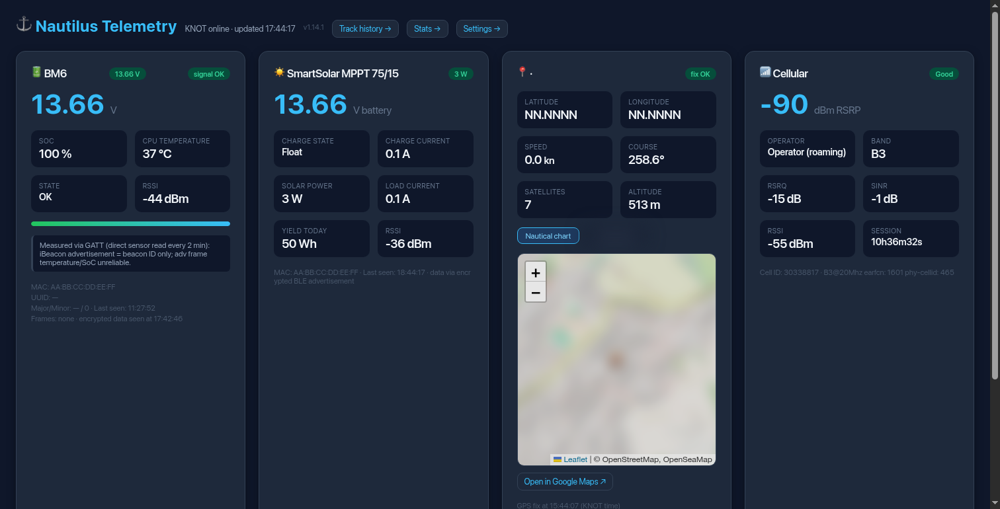

# Nautilus Telemetry — Manual



The dashboard in action on a live deployment (identifying data redacted).

Nautilus is a self-hosted marine telemetry system for sailboats. It collects data
from onboard BLE sensors and the internal GPS through a MikroTik KNOT router
(typically connected via WireGuard) and serves everything on a real-time web
dashboard, packaged as a single Docker container.

A single codebase serves any number of boats: everything boat-specific is passed
through environment variables, with no per-boat code changes.

## 1. Architecture

```
BM6 battery monitor ──┐                        ┌──> BLE advertisement poll (60 s)
                      │                        │
MPPT solar charger ───┼─ BLE ─> MikroTik KNOT ──┼──> BM6 GATT connection (120 s)
                      │        REST API         └──> GPS monitor (120 s)
Internal GPS ─────────┘
                              │
                              v
                 nautilus-telemetry container (Flask :8080)
                              │
                              v
              dashboard (5 s auto-refresh) + /api/data JSON
```

Besides the web server, the app runs background threads:

| Thread | Interval | Purpose |
|---|---|---|
| poll_loop | 60 s | Reads `peripheral-devices` from the KNOT (only `persist=true` entries) and LTE monitor (RSRP/RSRQ/SINR) |
| gatt_loop | 120 s | Persistent GATT connection to the BM6 for real voltage/temperature/SoC/state |
| gps_loop | 120 s | Reads `/rest/system/gps/monitor` from the KNOT (blocking call, ~15–20 s) |
| bl917_loop (optional) | 300 s | Fetches BL917 MPPT data from the ZhiJinPower cloud via websocket |

## 2. Supported devices

### 2.1 Leagend BM6 battery monitor

The BM6 broadcasts two kinds of BLE advertisements, **neither of which contains
the real voltage**:

- **iBeacon** (Apple 0x004C): static identification only. The `major` field is a
  static ID, NOT the voltage — the "major/100 = V" formula from the original
  specification is wrong.
- **AES-128-CBC encrypted frame** (service data 0xFFF0, key
  `leagend\xff\xfe0100009`, null IV — see JeffWDH/bm6-battery-monitor):
  contains temperature and SoC, but the advertised values are unreliable
  (~15 °C off vs. the GATT reading).

**The reliable path is GATT** (RouterOS >= 7.12 supports the central role on
the KNOT):

1. `POST /rest/iot/bluetooth/connections/connect` with `pdev` = peripheral `.id`
2. `POST .../subscribe` on characteristic `fff4` (notify)
3. `POST .../write` on `fff3` with `data-hex` = `697ea0b5d54cf024e794772355554114`
   (AES-encrypted `d15507` command, constant)
4. `GET .../async-data` → encrypted notifications; decrypt and parse frame
   `d15507`:
   - byte 3: temperature sign (1 = negative), byte 4: temperature °C
   - byte 5: state (0=OK, 1=low voltage, 2=charging)
   - byte 6: SoC %
   - bytes 7–8: voltage big-endian / 100

The GATT connection is persistent: the BM6 keeps notifying while connected. The
app reuses the connection and re-issues the command each cycle (idempotent).
GATT values always take precedence and are never overwritten by ADV data.

Note: the BM6 temperature measures the internal chip, not ambient air. The
dashboard labels it "CPU temperature".

### 2.2 Power Queen / Lumiax BT-PQCC2430 MPPT charger

- The advertisement only carries MAC, name and UART service 0xFFE0: no
  Modbus data via ADV.
- Modbus RTU registers (map from solarlife-mppt-ble-client: V_pv 0x304E,
  V_bat 0x3046, I_bat 0x3047, SoC 0x3045, powers, energies…) travel on GATT
  service `ffe0`, characteristics `ffe1` (read/write/notify) and `ffe2`
  (write-no-response), device-id 0xFE, function code 0x04, CRC16 Modbus.
- **Known limitation**: RouterOS `connections/write` only does
  write-with-response, but `ffe2` accepts write-without-response only, so the
  Modbus command never leaves. The MPPT card shows presence/RSSI with a
  technical note. Unlocking the registers requires a script on the KNOT
  itself or an external BLE proxy (ESP32/ESPHome).

### 2.3 BL917 MPPT (optional)

Data lives on the ZhiJinPower cloud (`ws://device.gz529.com/`) and is read via
websocket using only the MAC. Enable with `BL917_ENABLED=1`. If the controller
was never registered through the vendor app, the cloud returns empty data.

### 2.4 Victron SmartSolar MPPT (optional)

Data comes from encrypted "Instant Readout" advertisements (manufacturer data
0x02E1, AES-128-CTR with a per-device key readable in VictronConnect → Product
Info → Instant Readout Details). Enable by setting `VICTRON_MAC` or
`VICTRON_SERIAL`.

### 2.5 KNOT GPS

`POST /rest/system/gps/monitor` with `{"once": "true"}` → latitude/longitude in
decimal degrees, speed, course, satellites, altitude. The call is **blocking**
(it waits for the fix): do not call it in parallel with the poll loop and use
a timeout >= 75 s.

## 3. Configuration

All configuration is via environment variables (see `.env.example`):

| Variable | Required | Purpose |
|---|---|---|
| `KNOT_HOST` | yes | KNOT address (e.g. its WireGuard IP) |
| `KNOT_USER` / `KNOT_PASS` | yes | KNOT REST API Basic Auth credentials |
| `BM6_MAC` / `MPPT_MAC` | yes | MAC addresses of the BLE sensors |
| `BOAT_NAME` | no | Boat name shown in the dashboard (default "Nautilus") |
| `URL_PREFIX_ALIAS` | no | Alternative URL prefix for the dashboard (default `/nautilus`) |
| `INTERNAL_TOKEN` | no | Shared token for the position-history backend APIs |
| `CONTICINI_BASE` | no | Base URL of the external position-history backend |
| `BL917_ENABLED` | no | `1` to enable the BL917 cloud thread |
| `BL917_MAC` / `BL917_WS` | no | BL917 MAC / cloud websocket URL |
| `BL917_TEMP_OFFSET` | no | Temperature correction in °C (default 0) |
| `VICTRON_MAC` / `VICTRON_SERIAL` | no | Victron MPPT identifiers |
| `VICTRON_ADV_KEY` | no | Victron Instant Readout AES key |
| `STATIONARY_SPEED_KN` | no | Below this speed the boat counts as stationary (default 0.5 kn) |
| `GPS_STATIONARY_INTERVAL` | no | Seconds between GPS polls while stationary (default 600) |
| `SOLAR_DB` | no | SQLite file for solar power samples (default `data/nautilus.db`) |
| `VICTRON_PUK` | no | Victron PUK (for key derivation) |

## 4. Dashboard

- Dark theme, responsive, auto-refresh every 5 s, boat name in the header
- **BM6 card**: voltage (GATT source), SoC with progress bar, temperature
  ("CPU temperature"), state, RSSI
- **MPPT card**: presence, RSSI, technical note when registers are unreachable
- **GPS card**: coordinates, **speed in knots** (converted from the KNOT km/h;
  `speed_kmh` also present in the API), course, satellites, altitude
- **LTE card**: RSRP as the main value with a qualitative rating (Excellent >
  -80, Good > -95, Weak > -110, Poor below), RSRQ, SINR, RSSI, operator, band
- **Map**: Leaflet + OpenStreetMap with the OpenSeaMap nautical overlay
  (buoys, lights, shallows) as the default view; Google Maps toggle
- **Track history page** (`/nautilus/track`): polyline of saved positions with
  hover tooltips (date/time, speed in knots, course with compass direction);
  filters by date range or last N points
- Clear indicators when a sensor stops transmitting (cards show "no data")
- `/api/data` returns the full state as JSON:

```json
{
  "bm6":  {"voltage": 13.29, "voltage_source": "gatt", "soc": 76,
           "temperature": 33, "state": "OK", "rssi": "-40"},
  "mppt": {"adv_name": "BT-PQCC2430", "rssi": "-35", "telemetry": false},
  "gps":  {"latitude": 41.0026, "longitude": 9.5599, "valid": true,
           "speed_kn": 0.0, "true_bearing": 18.4, "satellites": 8,
           "altitude_m": 3.0},
  "lte":  {"operator": "…", "band": "B7", "rsrp": -98.0, "rsrq": -19.0,
           "sinr": -4.0, "rssi": -63.0, "quality": "…"},
  "version": "…", "last_poll": "15:49:30", "updated": "2026-09-05T15:49:30"
}
```

## 4b. Adaptive GPS reporting

The GPS monitor call to the KNOT is blocking (~15–20 s) and keeps the radio
busy, which matters on a battery-powered boat. When the last valid fix shows a
speed below `STATIONARY_SPEED_KN`, the gps loop skips the KNOT call entirely
until `GPS_STATIONARY_INTERVAL` seconds have passed since that fix; while
moving it polls at the normal cadence. The current mode is exposed in
`/api/data` as `gps.report_mode` (`"moving"` / `"stationary"`).

## 4c. Solar production history and forecast

At every poll cycle the app samples the solar power (W) from whichever source
is available — Victron `solar_power_w`, Power Queen MPPT `watt`, or BL917
`i_charge × v_bat` — and appends it to a local SQLite database
(`SOLAR_DB`, default `data/nautilus.db`, table `solar_samples`; mount the
directory as a volume to persist it).

The dashboard shows a graph of the day's production (30-minute averages) with
yesterday's curve and a forecast (average of up to 7 previous days with data)
overlaid; the card header shows the approximate Wh produced today. The data is
served by `/api/solar/daily`:

```json
{"today": [[9.5, 12.3], ...], "yesterday": [[...]],
 "forecast": [[...]] | null, "today_wh": 45.6, "yesterday_wh": 61.2,
 "history_days": 3}
```

Note: on boats whose MPPT registers are unreachable (Power Queen behind the
RouterOS limitation, see §2.2) no samples are recorded until that path or a
BL917/Victron device provides power data.

## 4d. Consumption history and energy stats

Consumption (W) is sampled the same way from the load current
(`i_load × v_bat`, Victron or BL917 load output) into the `load_samples`
table, served by `/api/load/daily` (today/yesterday/forecast curves) and
shown in the dashboard as a "Current used" card next to solar production.

The `/stats` page shows the cumulative energy accounting:

- average solar day per month as per-month mini charts (grid under the monthly table), each titled with the month's Wh and peak; same Y scale on every chart so months compare directly (API: `/api/stats/monthly-curve`)
- bar comparison of produced vs consumed per month, shown in Wh (boat-scale values; a day is a fraction of a kWh)
- yearly table (produced, consumed, net) in kWh
- monthly table with net balance (Wh)

Totals come from `/api/stats/totals` (kWh estimated from 60 s samples:
`sum(watt) × 60 / 3.6M`). Samples persist in `SOLAR_DB`.

## 4e. Settings page and extended adaptive polling

The `/settings` page (Settings tab in the dashboard header) exposes all
polling parameters with live editing; values apply within one cycle without
restarting the container. Saves are in-memory runtime overrides: a container
restart restores the `.env` values ("Reset all" does the same immediately).

| Setting | Range | Purpose |
|---|---|---|
| `POLL_SECONDS` | 60–3600 | Main BLE/LTE data poll (solar & load sampling included) |
| `POLL_SECONDS_NIGHT` | 0–3600 | Reduced poll during the night window (0 = night mode off) |
| `NIGHT_START` / `NIGHT_END` | 0–23 | Night window, local time |
| `GPS_POLL_SECONDS` | 60–3600 | GPS cadence while moving |
| `GATT_POLL_SECONDS` | 60–3600 | BM6 GATT read cadence |
| `STATIONARY_SPEED_KN` | 0–20 | Stationary threshold for the adaptive GPS skip |
| `GPS_STATIONARY_INTERVAL` | 30–7200 | GPS interval while stationary |
| `SOLAR_HISTORY_DAYS` | 1–30 | Days feeding the forecast average |

API: `GET/POST /api/settings` (POST accepts a JSON object with numeric
values, `null` clears an override). Limits are enforced server-side.

## 4f. Load current source

"Current used" reads the MPPT **load output** (`i_load × v_bat`), i.e. only
the devices wired to the controller's LOAD terminals. Loads connected
directly to the battery (e.g. via a 12 V distribution panel) are not visible
to it; a battery shunt is required to measure total boat consumption.

## 5. Position history (optional backend)

Valid GPS fixes are POSTed to an external "conticini" management app
(`CONTICINI_BASE + /internal/boat/position`), authenticated with the
`X-Internal-Token` header. The backend deduplicates fixes closer than 25 m
(a boat moored in port produces one point). Nautilus proxies
`/api/boat/track-history` to the backend so the dashboard can draw the
historical track. Both features are inactive when `INTERNAL_TOKEN` is empty.

## 6. Running

```bash
cp .env.example .env   # fill in your values
docker compose up -d --build
```

Quick checks:

```bash
docker logs -f nautilus-telemetry
curl -s http://localhost:8080/api/data | python3 -m json.tool
```

## 7. Troubleshooting

| Symptom | Cause | Fix |
|---|---|---|
| BM6 voltage missing > 5 min | GATT connection dropped | The thread re-establishes it on the next cycle; `docker logs` shows "GATT BM6 fallito" |
| 400 errors on connect | BM6 already connected (or slots full) | The app reuses the connection; check `GET .../connections` |
| GPS missing | Blocking call / timeout | Test with curl and a 90 s timeout; the KNOT needs open sky |
| Odd BM6 temperature | Taken from ADV instead of GATT | Unreliable ADV value; overwritten when GATT is active |
| No MPPT register data | write-no-response unsupported via REST | Structural limitation, see §2.2 |
